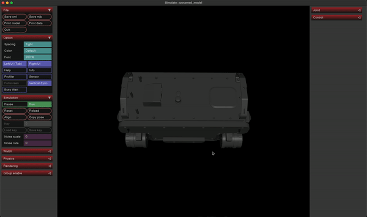
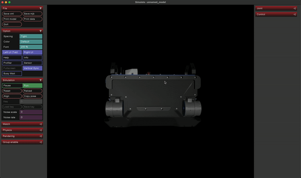

# obj2mjcf

A tool for converting Wavefront OBJ files into MuJoCo sub-meshes grouped by material.

Currently, MuJoCo does not support OBJ files with groups or objects (i.e., `o` or `g`). Furthermore, only 1 material can be assigned per mesh. This tool is designed to split such OBJ files into sub-meshes grouped by material. The resulting sub-meshes can then be used as a drop-in replacement for the original OBJ file. The result is vastly enhanced visuals for your model:

| Before | After |
|--------|-------|
|||

## Installation

```bash
pip install obj2mjcf
```

## Usage

```bash
usage: obj2mjcf [-h] --obj_dir OBJ_DIR [--save_mtl] [--save_mjcf] [--verbose]

optional arguments:
  -h, --help         show this help message and exit
  --obj_dir OBJ_DIR  Path to a directory containing obj files.
  --save_mtl         Whether to save the mtl files.
  --save_mjcf        Whether to save an example MJCF file.
  --verbose          Whether to print verbose output.
```
